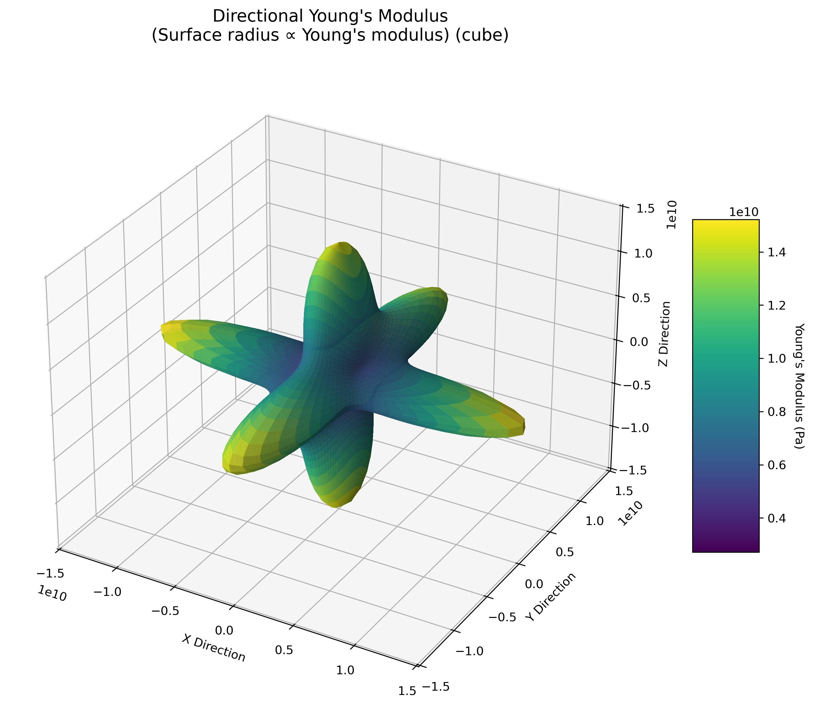
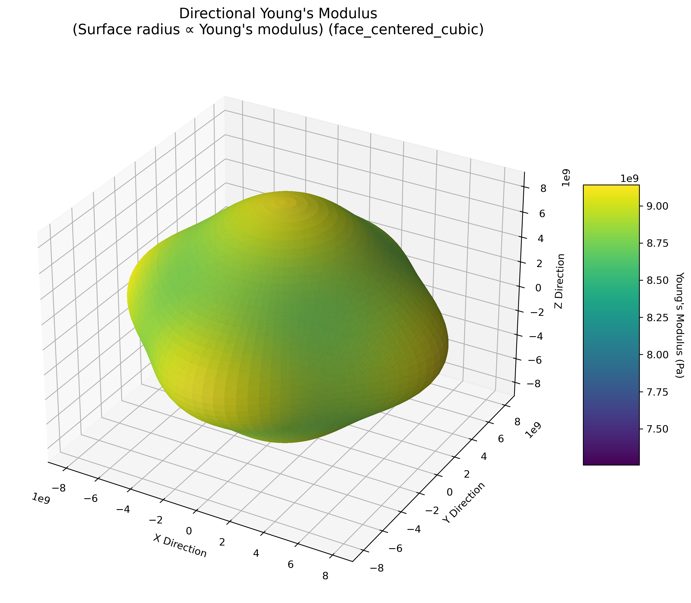
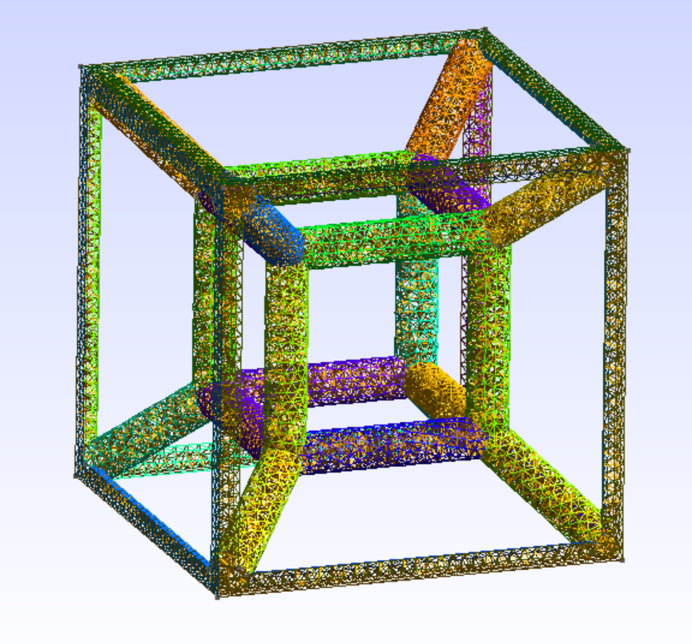
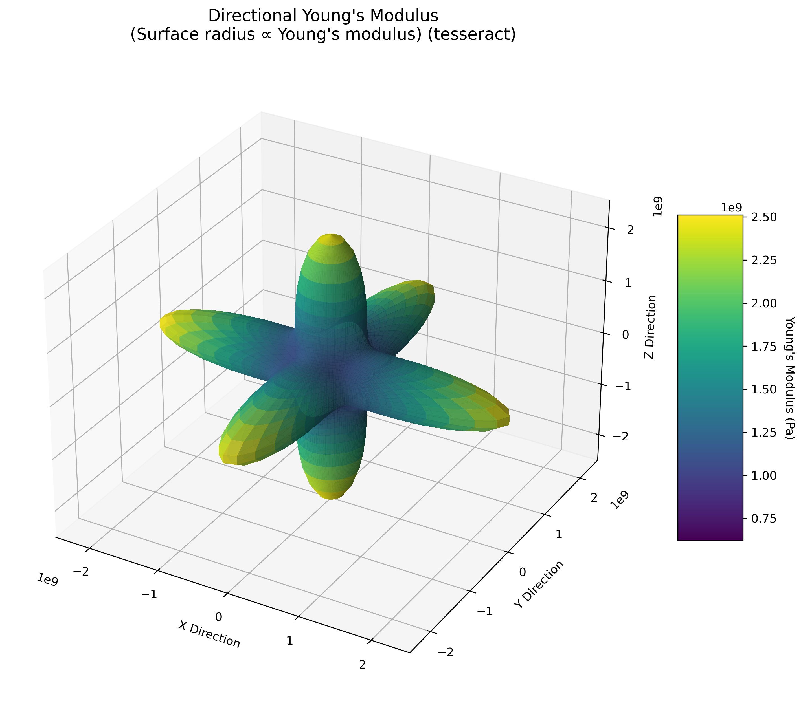
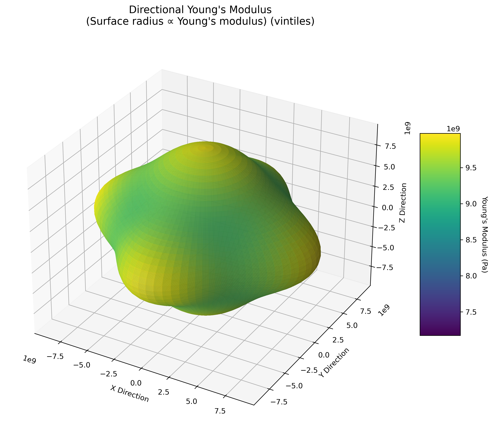

# Cell Homogenization solver using FEnicsx

## 1) Introduction
🚀 This is a Fenicsx python project using finite element method (FEM) to compute effective stiffness tensor of cells. 

The following equation is what this program solves and used to compute effective stiffness tensor:

$$
C_{ijkl}^{H}= \frac{1}{|Y|} \int_{Y} C_{pqrs} (\varepsilon_{pq}^{0(ij)} -\varepsilon_{pq}^{(ij)}) (\varepsilon_{rs}^{0(kl)} - \varepsilon_{rs}^{(kl)}) d\Omega
$$

Where $\varepsilon_{pq}^{0(ij)}$  is the unit strain tensor, $\varepsilon_{pq}^{(ij)}$ is strain tensor, they satisfy the following equations : 

$$
\varepsilon_{pq}^{0(kl)} = \delta_{pk} \delta_{ql}
$$

and : 

$$
\varepsilon_{pq}^{(ij)} = \varepsilon_{pq} (\chi^{ij})= \frac{1}{2} (\chi^{ij}_{p,q} + \chi^{ij}_{q,p}) 
$$

Also, $\varepsilon_{pq}^{(kl)}$ can be found by solving the elasticity **equations with the prescribed macroscopic strain** : 

$$
\int_{Y} C_{ijpq} \varepsilon_{ij}(\nu) \varepsilon_{pq}^{kl} dY  = \int_{Y} C_{ijpq} \varepsilon_{ij}(\nu) \varepsilon_{pq}^{0(kl)} dY 
$$

and then use this to compute the effective stiffness tensor (But we will not use this method in this program): 

$$
{C_{ijkl}^{H} = \frac{1}{|Y|} \int_{Y} \left( C_{ijkl} - C_{ijpq}\frac{ \partial \chi_{p}^{kl} }{ \partial y_{q} }  \right)dY}
$$

Note a equivalent solution is using the following equation to solve $\chi^{ij}_{p,q}$ : 

$$
\int_{Y} \left( C_{ijpq} \frac{ \partial \chi_{p}^{kl} }{ \partial y_{q} }  - C_{ijkl} \frac{ \partial v_{i}(y) }{ \partial y_{j} } \right) dY  = 0 \qquad  \forall  v \in  V_{\underline{Y}}
$$

### How to cite this work
Please cite this software using the following BibTeX entry (also available in CITATION.cff) when using this in academic research.

#### BibTex entry:
```latex
@software{fenicsx_cell_homogenization,
  author       = {Parrot, Fried},
  title        = {{FEniCSx Cell Homogenization Solver}},
  month        = {8},
  year         = {2025},
  publisher    = {GitHub},
  version      = {1.0.0},
  url          = {https://github.com/FRIEDparrot/fenicsx_cell_homogenization},
  note         = {Software for computational homogenization with FEniCSx}
}
```

## 2) Some Related work 

Closely related work has done by Dong et al using *voxel-based homogenization*. (2019), who provided a concise Matlab implementation for homogenization in lattice structures. You can refer to their work here: 

[**Guoying Dong, Yunlong Tang, Yaoyao Fiona Zhao. _A 149 Line Homogenization Code for Three-Dimensional Cellular Materials Written in Matlab_. Journal of Engineering Materials and Technology, 2019, 141(1). DOI: 10.1115/1.4040555**](https://hal.science/hal-04096537/document)

And this repo and found at [https://github.com/GuoyingDong/homogenization](https://github.com/GuoyingDong/homogenization) 

## 3) How to use this program
### 1. Install Dependencies
This program runs by [Fenicsx](https://docs.fenicsproject.org/), which can be installed by instructions here, or by following command:
```shell
conda create -n fenicsx-env
conda activate fenicsx-env 
conda install -n fenicsx-env -c conda-forge libopenblas # this might be necessary  
ls $CONDA_PREFIX/lib/libopenblas.so*  # validate
conda install -c conda-forge fenics-dolfinx mpich pyvista  # install main dependencies 
```=

[Gmsh](https://gmsh.info/) library is also required to generate cell mesh, you can install it by:

```shell
pip install --upgrade gmsh 
# pygmsh
# pip install --upgrade pygmsh  
pip install meshio
gmsh # start GUI interface 
```

### 2. How to Run the script
I recommend you use pycharm professional to run this project. 

```shell
git clone https://github.com/FRIEDparrot/fenicsx_cell_homogenization.git
cd fenicsx_cell_homogenization  # set working directory  
```

Run `tests/cell_generation.py` to generate cell mesh of all cells in cells directory under the test folder. 
```shell
# ADD THE PROJECT PATH TO TEMPORARY PYTHONPATH WHEN RUN
conda run -n fenicsx-env PYTHONPATH=. python -m tests.cell_generation 
```

Run `tests/cell_homogenization_tests.py` to compute effective stiffness tensor for all cells and visualize the results. 
```shell
# ADD THE PROJECT PATH TO TEMPORARY PYTHONPATH WHEN RUN
conda run -n fenicsx-env PYTHONPATH=. python -m tests.cell_homogenization_tests 
```

this will calculate and show all result pictures (close it to make program run and show next), this is the example picture (first shown) 


If you want calculate faster, you can change `V = functionspace(self.domain, ("CG", 2, (self.dim,)))` to 1-degree element, which will also cause result to be less accurate.

You may carefully adjust the mesh size of cells when calculating. 

## 4) Some Examples and Results 

1. Cube cell  

Cell mesh: 


result for directional young modulus: 



2. Octet cell

cell mesh: 


result for directional young modulus: 


3. Face center cubic cell 

cell mesh: 


result for directional young modulus: 



4. Tesseract cell

cell mesh: 



result for directional young modulus: 




5. Vintiles cell 

cell mesh:


result for directional young modulus:




> [!bug]  
> tetrahedron cell mesh would fail to be read mesh because of problem of multi-elements auto generated by gmsh. 
>
